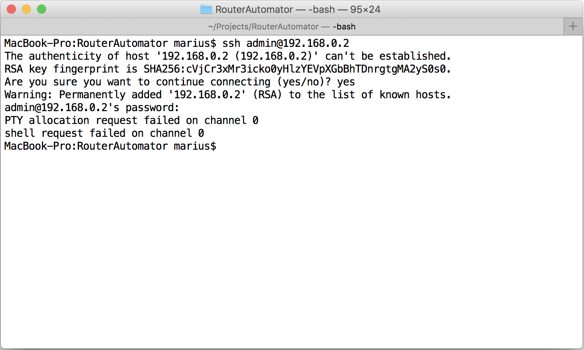
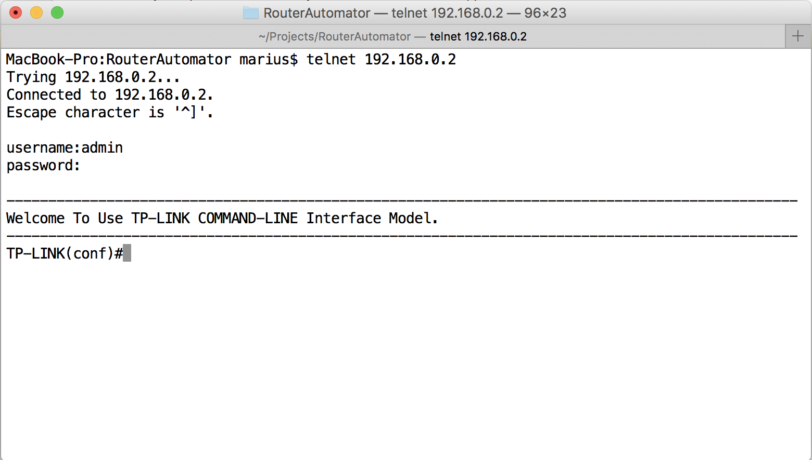
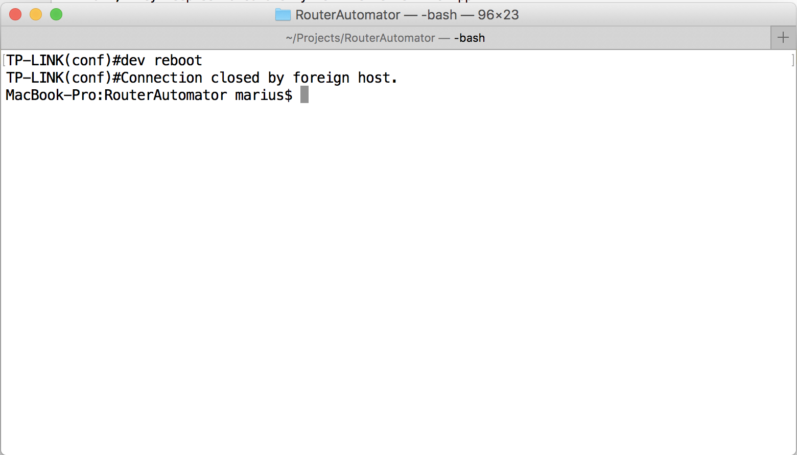
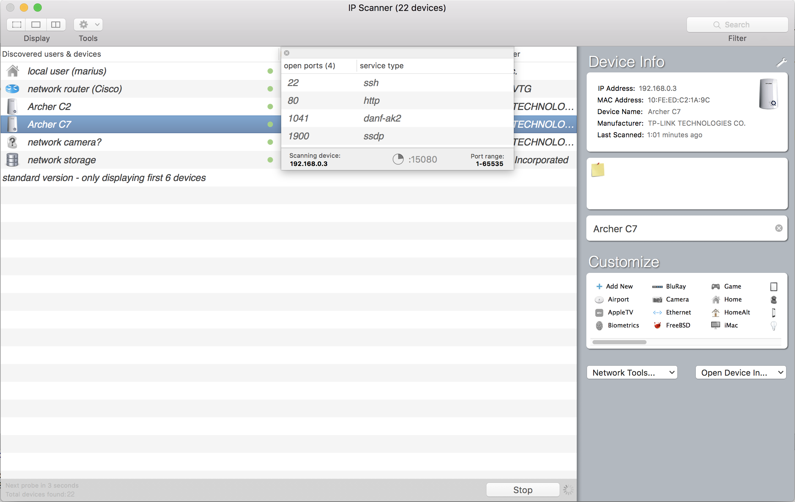
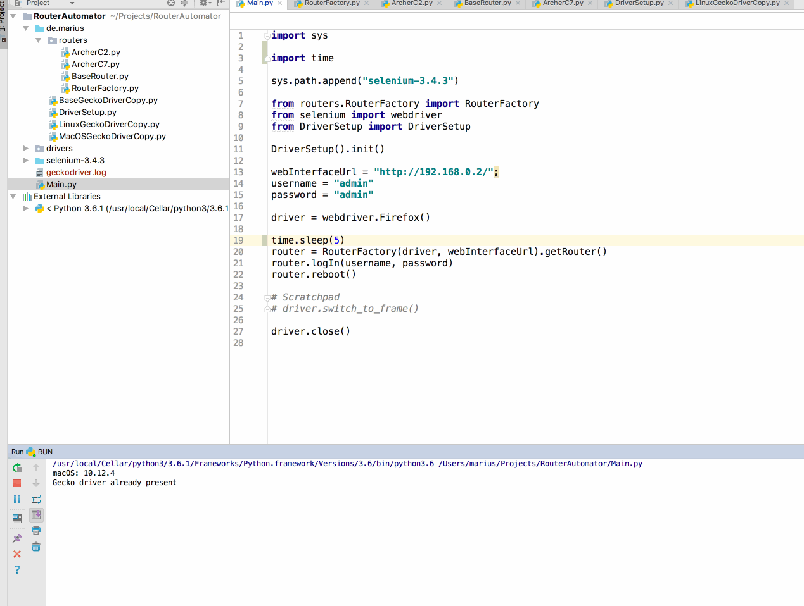

**Description:**
This little project allows you to automate tasks on your router.
It's written in Python 3 and it uses Selenium and the gecko web driver, so you need to have Firefox to get it running.

To use it make sure you have Python 3 and Firefox installed. Then edit the Config.ini file to your needs.

Example:

    [actions]
    rebootMainRouter: true
    anotherAction: false
    
    [rebootMainRouter]
    routerIP: http://192.168.0.1
    username: admin
    password: admin
    tasks: login,reboot
    
    [anotherAction]
    routerIP: http://192.168.0.3
    username: admin
    password: admin
    tasks: login, reboot

Finally run Main.py like so: `python3 Main.py`

Tested on:
*   macOS Sierra 10.12.5
*   Ubuntu Ubuntu 16.04 LTS
*   Windows 10

**Background**:
A few of my routers need to be rebooted periodically, otherwise they slow down. The obvious approach is to schedule them to reboot, BUT TP-LINK doesnt think that's something normal users want, so no such option is provided.

So the next thing would be to run a script somewhere that connects to the router and reboots the thing. But how exactly?

A quick portscan with the useful IP Scanner tool (http://10base-t.com/macintosh-software/ip-scanner/) revealed that SSH and TELNET are available

Let's try SSH:

Fail, they keep ssh around only for the Tether 2.0 App

Let's try telnet:

I'm in and it works. Yay!

But another of my routers doesn't have telnet running. Darn it!

A crude alternative would be a power switch with a timer, but come on, we're both on github for the sweet sweet code :D

Selenium to the rescue! I thought I just write some UI tests that log into the webinterface and click around and this is the solution I stuck with.

Right now I only support some of my problematic routers: TP-LINK Archer C2 and the Archer C7, latest firmware.

**ToDo:**
~~Next step is deploying this to a raspi that's always on (I've got a Rapberry Pi Zero that runs my LanClients project) and fire the router reboot every night at 3:00 a.m. with a cron job.~~
The RouterAutomator runs on a raspberry pi zero for some time now. Every night at 3:00 a.m. it restarts two access points and the main router.

**Pro Tip:** This is obvious if you think about it, but if you don't then it will cause a lot of headaches - consider the order in which you reboot your APs/Routers.
For example, given my simplified network topology (see below, switches and powerline adapters are left out), the order in which I reboot them is B, A and finally C.

      A
      |
    -----
    |   |
    B   C <-- Raspi Zero
